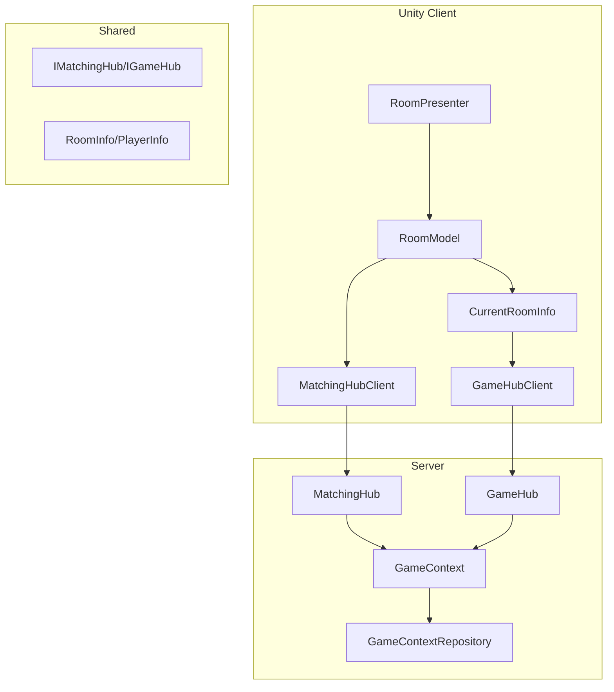
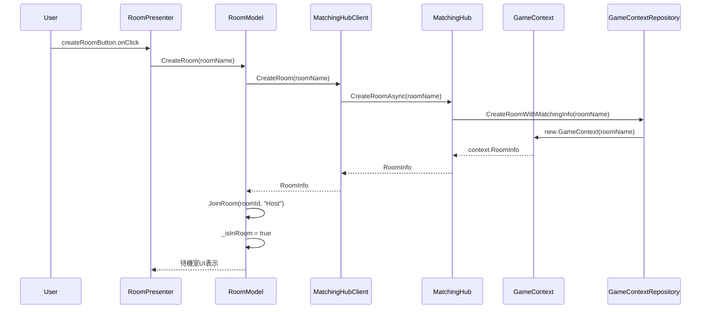
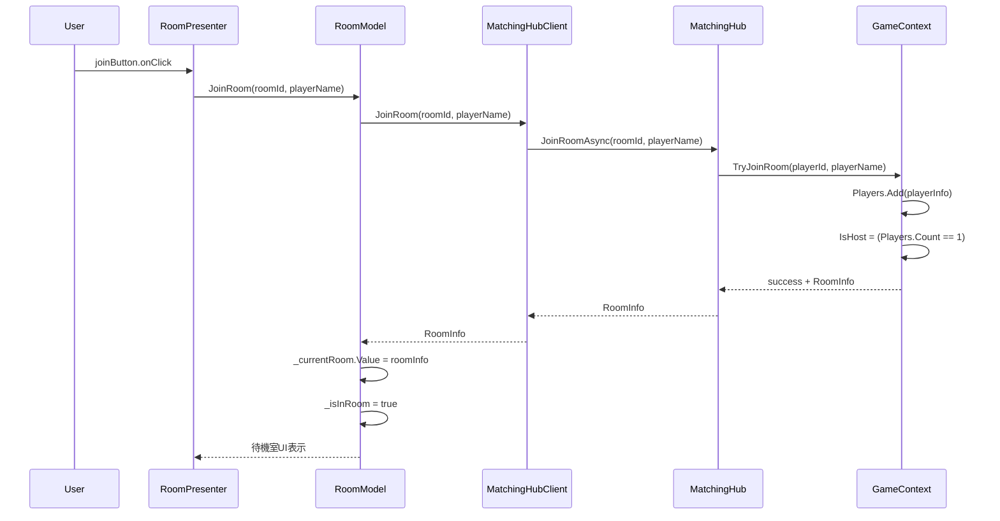
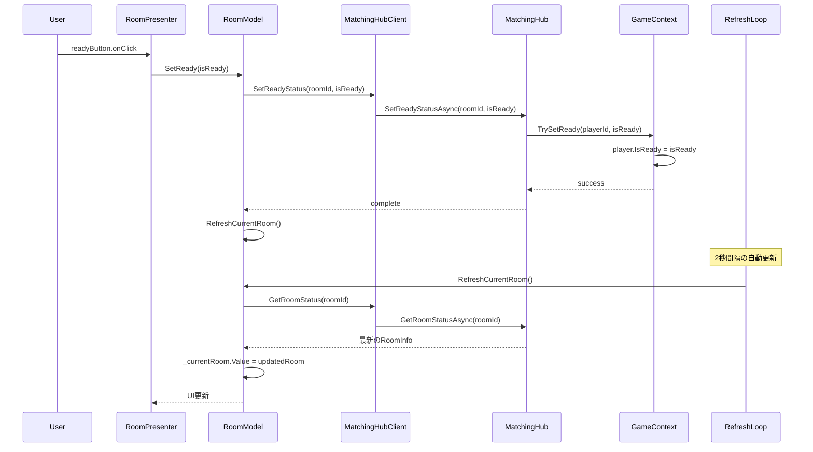
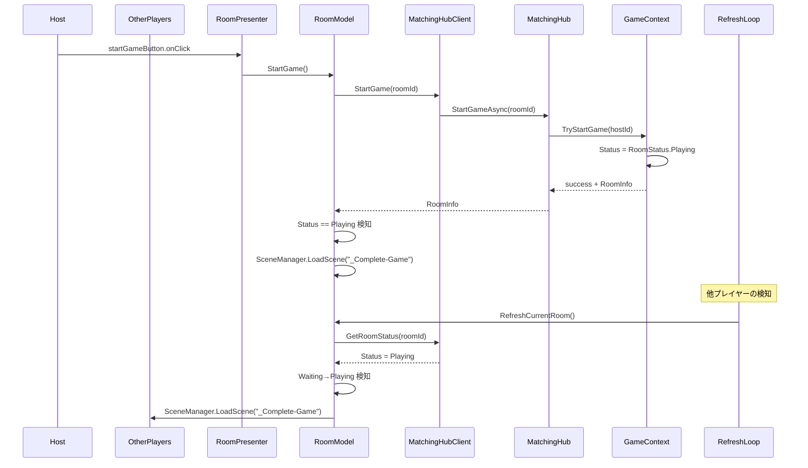
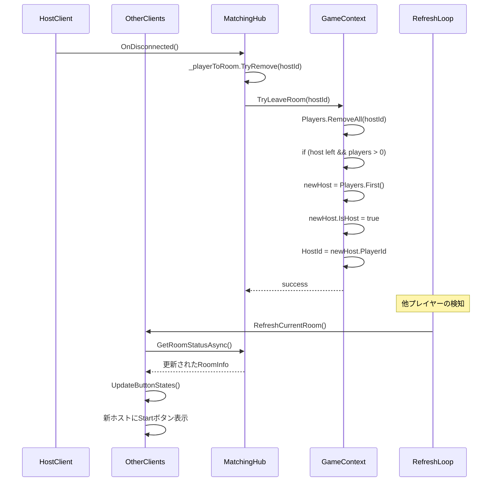
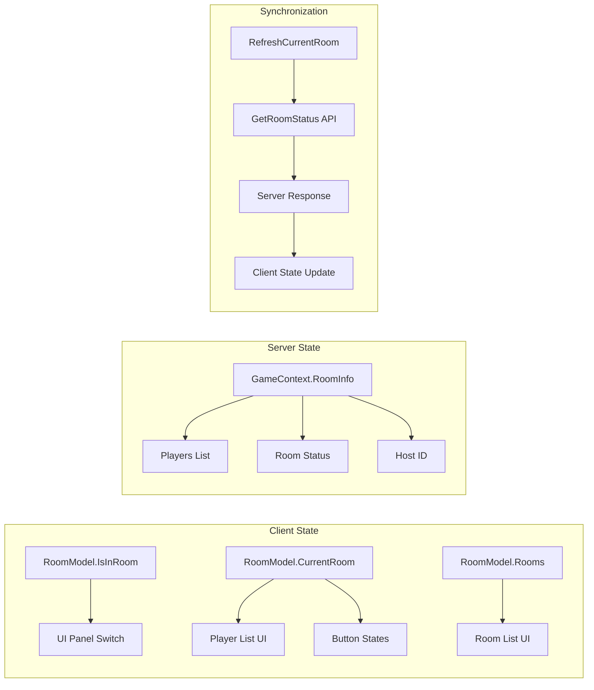

# 現在のマッチングシステム完全ドキュメント

## 概要

このドキュメントでは、現在実装されているMatchingHubベースの待機室システムの完全な仕組みを説明します。ルーム作成からゲーム開始まで、Model、UI、Server間の詳細な流れを含みます。

## システムアーキテクチャ



## データモデル

### RoomInfo
```csharp
public class RoomInfo
{
    public Guid RoomId { get; set; }           // ルームID
    public string RoomName { get; set; }       // ルーム名
    public List<PlayerInfo> Players { get; set; } // プレイヤーリスト
    public RoomStatus Status { get; set; }     // ルーム状態
    public Guid HostId { get; set; }           // ホストID
    public int MaxPlayers { get; set; }        // 最大プレイヤー数
}
```

### PlayerInfo
```csharp
public class PlayerInfo
{
    public Guid PlayerId { get; set; }         // プレイヤーID
    public string PlayerName { get; set; }    // プレイヤー名
    public bool IsHost { get; set; }           // ホストフラグ
    public bool IsReady { get; set; }          // Ready状態
}
```

### RoomStatus
```csharp
public enum RoomStatus
{
    Waiting = 0,    // 待機中（プレイヤー参加可能）
    Playing = 1,    // ゲーム中（観戦参加可能）
    Finished = 2    // 終了（参加不可）
}
```

## 詳細フロー

### 1. ルーム作成フロー



**詳細処理**:
1. **UI操作**: ユーザーがルーム名を入力してCreateボタンをクリック
2. **バリデーション**: 入力値チェック（空文字列禁止）
3. **サーバー通信**: MatchingHubClientを経由してサーバーにルーム作成要求
4. **サーバー処理**: GameContextRepositoryでGameContextを作成、RoomInfoを初期化
5. **自動参加**: 作成者が自動的にホストとしてルームに参加
6. **UI更新**: IsInRoomプロパティでルームリストから待機室UIに切り替え

### 2. ルーム参加フロー



**詳細処理**:
1. **参加条件チェック**: ルーム状態（Waiting/Playing）、最大プレイヤー数、重複参加
2. **プレイヤー情報作成**: PlayerInfoオブジェクト生成（最初の参加者がホスト）
3. **サーバー状態更新**: GameContextのPlayersリストに追加
4. **クライアント状態更新**: RoomModelの現在ルーム情報を更新
5. **UI切り替え**: 待機室UIを表示、プレイヤーリスト更新

### 3. 待機室UI管理

```mermaid
graph TB
    subgraph "RoomModel (Reactive Properties)"
        IsInRoom[IsInRoom ReactiveProperty]
        CurrentRoom[CurrentRoom ReactiveProperty]
        Rooms[Rooms ReactiveCollection]
    end
    
    subgraph "RoomPresenter (UI Components)"
        RoomListPanel[roomListPanel]
        WaitingRoomPanel[waitingRoomPanel]
        PlayerList[playerListParent]
        StartButton[startGameButton]
        ReadyButton[readyButton]
        LeaveButton[leaveRoomButton]
    end
    
    subgraph "UI State Management"
        ShowRoomList[roomListPanel.SetActive(!isInRoom)]
        ShowWaitingRoom[waitingRoomPanel.SetActive(isInRoom)]
        UpdatePlayerList[UpdatePlayerList()]
        UpdateButtonStates[UpdateButtonStates()]
    end
    
    IsInRoom --> ShowRoomList
    IsInRoom --> ShowWaitingRoom
    CurrentRoom --> UpdatePlayerList
    CurrentRoom --> UpdateButtonStates
    
    UpdatePlayerList --> PlayerList
    UpdateButtonStates --> StartButton
    UpdateButtonStates --> ReadyButton
```

**UI状態管理**:
- **IsInRoom**: ルーム参加状態でパネル表示/非表示を制御
- **CurrentRoom**: ルーム情報変更でプレイヤーリストとボタン状態を更新
- **スタートボタン**: ホストのみ表示、待機状態でのみ有効
- **Readyボタン**: ホスト以外に表示、Ready/Not Ready切り替え
- **プレイヤーリスト**: リアルタイム更新、ホスト・Ready状態表示

### 4. Ready状態管理フロー



**Ready状態の特徴**:
- **ホスト**: Readyボタンなし、常にゲーム開始可能
- **他プレイヤー**: Ready/Not Ready切り替え可能
- **自動更新**: 2秒間隔でサーバーから最新状態を取得
- **UI反映**: Ready状態変更は即座にプレイヤーリストに反映

### 5. ゲーム開始フロー



**ゲーム開始の流れ**:
1. **ホスト権限チェック**: ホストのみがゲーム開始可能
2. **状態変更**: RoomStatus.Waiting → RoomStatus.Playing
3. **即座のシーン遷移**: ホストは StartGame 成功時に即座にゲームシーンへ
4. **他プレイヤーの検知**: 定期更新（最大2秒遅延）でゲーム開始を検知
5. **自動シーン遷移**: 状態変化検知で自動的にゲームシーンへ

### 6. ホスト離脱・権限移譲フロー



**ホスト権限移譲の特徴**:
- **自動処理**: ホスト切断時に自動的に次のプレイヤーがホストに昇格
- **権限継承**: 新ホストは即座にゲーム開始権限を取得
- **UI更新**: 定期更新でスタートボタンの表示/非表示が切り替わる
- **空ルーム処理**: 全プレイヤーが退出した場合のルーム削除（現在はコメントアウト）

## リアルタイム更新システム

### 現在の実装（ポーリングベース）

```csharp
// RoomModel.cs
private async UniTask StartCurrentRoomRefreshLoop()
{
    while (this != null)
    {
        await UniTask.Delay(2000); // 2秒間隔
        
        if (_isInRoom.Value && _currentRoom.Value != null && !_isRefreshingCurrentRoom)
        {
            await RefreshCurrentRoom();
        }
    }
}
```

**更新対象**:
- プレイヤー参加/退出
- Ready状態変更
- ホスト権限移譲
- ゲーム開始検知

### 将来的な実装（リアルタイム通知）

```csharp
// 実装予定のイベント通知
public void OnPlayerJoinedRoom(PlayerInfo playerInfo, RoomInfo roomInfo)
public void OnPlayerLeftRoom(Guid playerId, RoomInfo roomInfo)
public void OnPlayerReadyChanged(Guid playerId, bool isReady)
public void OnGameStarted(Guid gameContextId, RoomInfo roomInfo)
```

## エラーハンドリング

### クライアント側
- **接続エラー**: MatchingHubClient接続失敗時の再試行
- **通信エラー**: 各API呼び出し時のtry-catch処理
- **バリデーション**: 入力値チェック（空文字列、重複参加など）

### サーバー側
- **ルーム不存在**: 存在しないルームへのアクセス
- **権限エラー**: ホスト以外のゲーム開始試行
- **状態エラー**: 不正な状態遷移の試行

## 技術的特徴

### Reactive Programming
- **UniRx**: リアクティブプロパティによるUI自動更新
- **データバインディング**: Model → View の自動同期
- **状態管理**: 一元化されたアプリケーション状態

### 非同期処理
- **UniTask**: スムーズな非同期処理
- **await/async**: ブロッキングなしの通信処理
- **エラーハンドリング**: 例外の適切な処理

### 状態同期
- **定期更新**: 2秒間隔の自動状態同期
- **状態検知**: RoomStatus変化によるイベント発生
- **データ整合性**: サーバー側での状態管理

## データフロー図



## パフォーマンス考慮事項

### 現在の制限
- **ポーリング遅延**: 最大2秒の状態更新遅延
- **帯域幅**: 定期的なAPI呼び出しによる通信量
- **スケーラビリティ**: 同時ルーム数の制限

### 最適化案
- **WebSocket/SignalR**: リアルタイム通信の実装
- **差分更新**: 変更部分のみの更新
- **キャッシュ**: 頻繁にアクセスされるデータのキャッシュ

## 今後の拡張計画

### 短期的改善
1. **リアルタイム通知**: MagicOnion Group機能の実装
2. **UI改善**: ローディング表示、エラーメッセージ
3. **バリデーション強化**: より詳細な入力チェック

### 長期的拡張
1. **認証システム**: プレイヤー認証・権限管理
2. **ルーム設定**: プライベートルーム、観戦者設定
3. **統計機能**: プレイヤー統計、ルーム履歴
4. **チャット機能**: 待機室内チャット

このドキュメントは現在の実装状態を反映しており、システムの完全な理解と今後の開発指針を提供します。