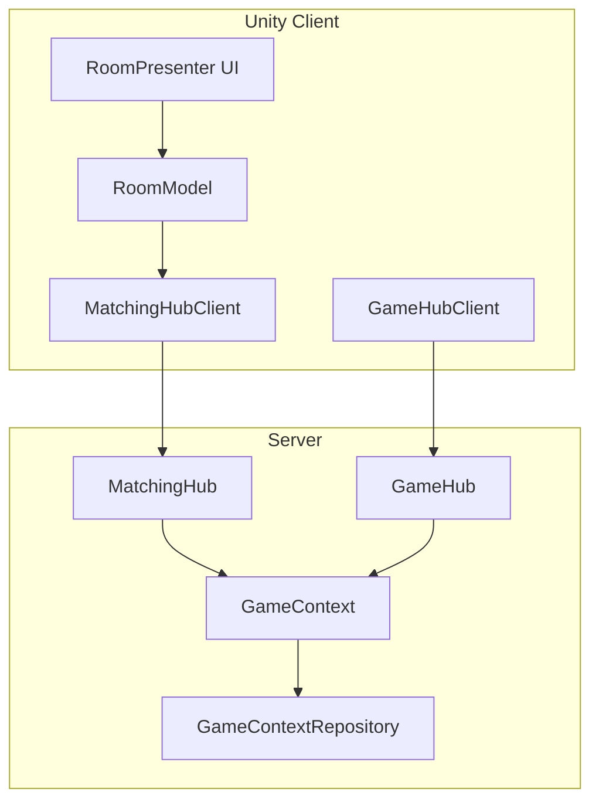

# MatchingHub待機室システム - 実装フロー詳細

## 概要

このドキュメントでは、MatchingHubを使用した待機室システムの実装と、ルームジョインからゲーム開始、GameHubContextへの接続までの完全なフローについて説明します。

## システムアーキテクチャ



## 詳細フロー

### 1. ルーム作成・参加フロー

#### 1.1 ルーム作成
```
[Unity] RoomPresenter.OnCreateRoomButtonClicked()
  ↓
[Unity] RoomModel.CreateRoom(roomName)
  ↓
[Unity] MatchingHubClient.CreateRoom(roomName)
  ↓
[Server] MatchingHub.CreateRoomAsync(roomName)
  ↓
[Server] GameContextRepository.CreateRoomWithMatchingInfo(roomName)
  ↓
[Server] new GameContext(roomName) - RoomInfo自動生成
  ↓
[Unity] 自動的にJoinRoom()を呼び出し
```

#### 1.2 ルーム参加
```
[Unity] RoomPresenter.OnRoomJoinClicked()
  ↓
[Unity] RoomModel.JoinRoom(roomId, playerName)
  ↓
[Unity] MatchingHubClient.JoinRoom(roomId, playerName)
  ↓
[Server] MatchingHub.JoinRoomAsync(roomId, playerName)
  ↓
[Server] GameContext.TryJoinRoom(playerId, playerName)
  ↓
[Server] RoomInfo.Players.Add(playerInfo)
  ↓
[Unity] RoomModel.IsInRoom = true (UI状態切り替え)
```

### 2. 待機室状態管理

#### 2.1 UI状態管理
```
[Unity] RoomModel.IsInRoom.Subscribe()
  ↓
[Unity] RoomPresenter - roomListPanel.SetActive(!isInRoom)
  ↓
[Unity] RoomPresenter - waitingRoomPanel.SetActive(isInRoom)
```

#### 2.2 リアルタイム更新
```
[Unity] RoomModel.StartCurrentRoomRefreshLoop()
  ↓ (2秒ごと)
[Unity] RoomModel.RefreshCurrentRoom()
  ↓
[Unity] MatchingHubClient.GetRoomStatus(roomId)
  ↓
[Server] MatchingHub.GetRoomStatusAsync(roomId)
  ↓
[Server] GameContext.RoomInfo (最新状態)
  ↓
[Unity] RoomModel.CurrentRoom.Value更新
  ↓
[Unity] RoomPresenter.UpdateWaitingRoomUI()
```

### 3. ゲーム開始フロー

#### 3.1 Ready状態管理
```
[Unity] RoomPresenter.OnReadyButtonClicked()
  ↓
[Unity] RoomModel.SetReady(isReady)
  ↓
[Unity] MatchingHubClient.SetReadyStatus(roomId, isReady)
  ↓
[Server] MatchingHub.SetReadyStatusAsync(roomId, isReady)
  ↓
[Server] GameContext.TrySetReady(playerId, isReady)
  ↓
[Server] PlayerInfo.IsReady = isReady
```

#### 3.2 ゲーム開始
```
[Unity] RoomPresenter.OnStartGameButtonClicked() (ホストのみ)
  ↓
[Unity] RoomModel.StartGame()
  ↓
[Unity] MatchingHubClient.StartGame(roomId)
  ↓
[Server] MatchingHub.StartGameAsync(roomId)
  ↓
[Server] GameContext.TryStartGame(hostId)
  ↓
[Server] RoomInfo.Status = RoomStatus.Playing
  ↓
[Unity] SceneManager.LoadScene(GAME_SCENE_NAME)
```

### 4. GameHubContext接続フロー

#### 4.1 ゲームシーン遷移後
```
[Unity] ゲームシーンロード
  ↓
[Unity] GameHubClient.Connect()
  ↓
[Unity] CurrentRoomInfo.Instance.RoomInfo (引き継ぎ)
  ↓
[Unity] GameHubClient.JoinAsync(roomId)
  ↓
[Server] GameHub.JoinAsync(roomId)
  ↓
[Server] GameContextRepository.TryGet(roomId)
  ↓
[Server] 既存のGameContext取得 (MatchingHubで作成済み)
  ↓
[Server] GameContext.AddPlayer(playerId)
  ↓
[Unity] ゲーム開始
```

## 主要コンポーネント詳細

### RoomModel (Unity Client)
- **役割**: ルーム状態の一元管理
- **主要プロパティ**:
  - `CurrentRoom`: 現在参加中のルーム情報
  - `IsInRoom`: ルーム参加状態（UI切り替え用）
  - `Rooms`: 全ルームリスト
- **主要メソッド**:
  - `CreateRoom()`: ルーム作成
  - `JoinRoom()`: ルーム参加
  - `LeaveRoom()`: ルーム退出
  - `StartGame()`: ゲーム開始
  - `SetReady()`: Ready状態変更
  - `RefreshCurrentRoom()`: ルーム情報更新

### RoomPresenter (Unity Client)
- **役割**: UI管理とユーザー操作ハンドリング
- **UI状態切り替え**:
  - `roomListPanel`: ルーム一覧表示
  - `waitingRoomPanel`: 待機室表示
- **待機室UI要素**:
  - プレイヤーリスト（ホスト・Ready状態表示）
  - スタートボタン（ホストのみ）
  - Readyボタン（ホスト以外）
  - 退出ボタン

### GameContext (Server)
- **役割**: ルームとゲーム状態の統合管理
- **データ構造**:
  - `RoomInfo`: MatchingHub用ルーム情報
  - `Players`: ゲーム内プレイヤー情報
  - `TankInfos`: タンク位置情報
  - `ShellInfos`: シェル情報
- **主要メソッド**:
  - `TryJoinRoom()`: ルーム参加処理
  - `TryLeaveRoom()`: ルーム退出処理
  - `TryStartGame()`: ゲーム開始処理
  - `TrySetReady()`: Ready状態変更

### MatchingHub (Server)
- **役割**: ルーム管理とマッチング処理
- **主要機能**:
  - ルーム作成・削除
  - プレイヤー参加・退出
  - Ready状態管理
  - ゲーム開始制御

## データフロー

### RoomInfo構造
```csharp
public class RoomInfo
{
    public Guid RoomId { get; set; }
    public string RoomName { get; set; }
    public List<PlayerInfo> Players { get; set; }
    public RoomStatus Status { get; set; } // Waiting, Playing, Finished
    public Guid HostId { get; set; }
    public int MaxPlayers { get; set; }
}
```

### PlayerInfo構造
```csharp
public class PlayerInfo
{
    public Guid PlayerId { get; set; }
    public string PlayerName { get; set; }
    public bool IsHost { get; set; }
    public bool IsReady { get; set; }
}
```

## 状態遷移

### ルーム状態
1. **Waiting**: 待機中（プレイヤー参加可能）
2. **Playing**: ゲーム中（観戦参加可能）
3. **Finished**: 終了（参加不可）

### UI状態
1. **ルームリスト表示**: `IsInRoom = false`
2. **待機室表示**: `IsInRoom = true`

## 技術的特徴

### 1. Reactive Programming
- UniRxを使用したリアクティブな状態管理
- UI自動更新とデータバインディング

### 2. 非同期処理
- UniTaskによるスムーズなユーザー体験
- ネットワーク通信の非同期処理

### 3. 状態同期
- クライアント・サーバー間での状態同期
- 定期的な自動更新（2秒間隔）

### 4. エラーハンドリング
- すべての非同期処理に例外処理を実装
- ネットワークエラーに対する堅牢性

## 今後の拡張可能性

### 1. リアルタイム通知
- MagicOnionのGroup機能を使用した即座の状態通知
- プレイヤー参加/退出のリアルタイム更新

### 2. 観戦機能
- ゲーム中ルームへの観戦参加
- 観戦者専用UI

### 3. ルーム設定
- 最大プレイヤー数の動的変更
- ゲームルール設定

### 4. 認証・権限
- プレイヤー認証システム
- ホスト権限移譲機能

## まとめ

この実装では、MatchingHubとGameHubが同じGameContextを共有することで、待機室からゲーム開始までのシームレスな体験を提供しています。ReactiveなUI管理により、リアルタイムでの状態更新が実現され、ユーザーフレンドリーなマルチプレイヤー体験を構築しています。