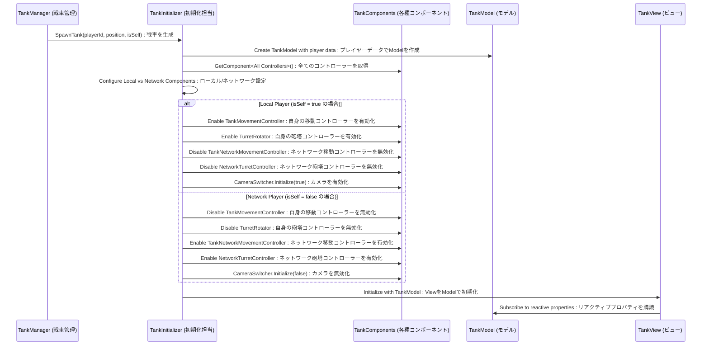
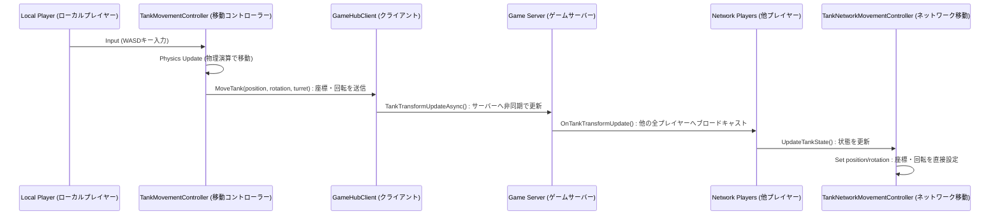
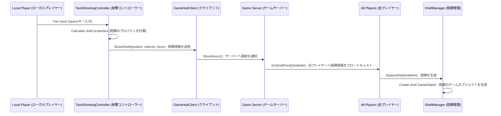

# Tankシステムアーキテクチャドキュメント (日本語版)

## 概要

このドキュメントは、`TankNew`フォルダ内に実装されている戦車ゲームのマルチプレイヤーアーキテクチャについて詳述します。
このシステムは、**モデル・ビュー・コントローラー (MVC)** パターンを基盤とし、**UniRx** を用いた **リアクティブプログラミング** を全面的に採用しています。この設計により、ローカルプレイヤー（自身が操作する戦車）とネットワークプレイヤー（他の参加者の戦車）のロジックを明確に分離しつつ、全クライアント間でゲームの状態を同期させる洗練された構造を実現しています。

---

## システムアーキテクチャ

### クラス図

```mermaid
classDiagram
    class TankInitializer {
        +Setup(bool isSelf) : 自身のプレイヤーかどうかに基づいてセットアップ
        +Initialize components : 全コンポーネントを初期化
        +Configure local vs network : ローカル・ネットワークに応じた設定
    }
    
    class TankModel {
        +ReactiveProperty~int~ Health : 体力 (リアクティブ)
        +ReactiveProperty~Color~ TankColor : 車体色 (リアクティブ)
        +ReactiveProperty~int~ PlayerNumber : プレイヤー番号 (リアクティブ)
        +ReactiveProperty~int~ Wins : 勝利数 (リアクティブ)
        +IReadOnlyReactiveProperty~bool~ IsDead : 死亡状態 (読み取り専用リアクティブ)
        +Subject~Unit~ OnDeath : 死亡時に発行されるイベント
    }
    
    class TankView {
        +Subscribe to model changes : Modelの変更を購読
        +Update UI elements : UI要素を更新
        +Handle visual effects : 視覚エフェクトを処理
    }
    
    class TankInputController {
        +Observable~Vector2~ MoveInput : 移動入力のストリーム
        +Observable~float~ TurretInput : 砲塔回転入力のストリーム
        +Observable~Unit~ FireInput : 発射入力のストリーム
    }
    
    class TankMovementController {
        +Move(Vector2 input) : 移動処理
        +Turn(float input) :旋回処理
        +Send network updates : ネットワークへ状態を送信
    }
    
    class TankNetworkMovementController {
        +UpdateTankState(position, rotation) : ネットワーク経由で状態を更新
        +Receive network updates : ネットワークからの更新を受信
    }
    
    class TankShootingController {
        +StartCharging() : 射撃チャージ開始
        +Fire() : 発射
        +Send shell to network : 砲弾情報をネットワークに送信
    }
    
    class CameraSwitcher {
        +SetCameraMode(bool enable) : カメラモードを設定
        +SwitchCamera() : TPS/FPSカメラを切り替え
        +Handle TPS/FPS modes : TPS/FPSモードを管理
    }
    
    class TurretRotator {
        +RotateTurret(float input) : 砲塔を回転
        +Local mouse control : マウスによるローカル制御
    }
    
    class NetworkTurretController {
        +SetTurretRotation(Quaternion) : 砲塔の回転をセット
        +Network-driven rotation : ネットワーク経由での回転
    }
    
    TankInitializer --> TankModel : 生成・管理
    TankInitializer --> TankView : 生成・管理
    TankInitializer --> TankInputController : 生成・管理
    TankInitializer --> TankMovementController : 生成・管理
    TankInitializer --> TankNetworkMovementController : 生成・管理
    TankInitializer --> TankShootingController : 生成・管理
    TankInitializer --> CameraSwitcher : 生成・管理
    TankInitializer --> TurretRotator : 生成・管理
    TankInitializer --> NetworkTurretController : 生成・管理
    
    TankView --> TankModel : 変更を購読 (subscribes)
    TankMovementController --> TankInputController : 入力を使用 (uses)
    TankShootingController --> TankInputController : 入力を使用 (uses)
    TurretRotator --> TankInputController : 入力を使用 (uses)
```



**解説:**
`TankInitializer`が中心となり、戦車の生成時に必要な全てのコンポーネントを初期化し、それがローカルプレイヤーかネットワークプレイヤーかに応じて適切な設定を行います。
`TankModel`は戦車の状態（体力、色など）をリアクティブプロパティとして保持します。`TankView`は`TankModel`の変更を購読し、UIやエフェクトを自動的に更新します。
入力は`TankInputController`が一元管理し、各操作系コントローラー(`TankMovementController`, `TankShootingController`など)がその入力ストリームを利用して動作します。

---

## 初期化フロー

### 戦車のスポーンとセットアップシーケンス



**解説:**
1.  `TankManager`が戦車の生成を`TankInitializer`に要求します。このとき、それが自身の操作する戦車 (`isSelf = true`) かどうかを伝えます。
2.  `TankInitializer`はまず、戦車の状態を管理する`TankModel`を生成します。
3.  次に、アタッチされている全てのコンポーネントへの参照を取得します。
4.  `isSelf`フラグに基づき、使用するコンポーネントを切り替えます。
    *   **ローカルプレイヤー**: 物理演算ベースの移動コントローラーや、マウスで操作する砲塔コントローラーを有効にします。ネットワーク経由で動くコンポーネントは無効化します。カメラも有効になります。
    *   **ネットワークプレイヤー**: 逆に、ネットワークからのデータで位置や回転を更新するコンポーネントを有効にし、ローカルでの操作系コンポーネントは無効化します。カメラも追従しないように無効化されます。
5.  最後に`TankView`を初期化し、`TankModel`の変更を購読させ、状態がUIに反映されるようにします。

---

## コンポーネントアーキテクチャ

### ローカルプレイヤーとネットワークプレイヤーのコンポーネント構成

```mermaid
graph TB
    subgraph "ローカルプレイヤー (isSelf = true)"
        LI[TankInputController<br>(入力管理)] --> LM[TankMovementController<br>(移動制御)]
        LI --> LS[TankShootingController<br>(射撃制御)]
        LI --> LT[TurretRotator<br>(砲塔回転)]
        LM --> GHC[GameHubClient<br>(ネットワーク通信)]
        LS --> GHC
        LC[CameraSwitcher<br>(カメラ制御)] --> CA[Active Cameras<br>(有効なカメラ)]
    end
    
    subgraph "ネットワークプレイヤー (isSelf = false)"
        NM[TankNetworkMovementController<br>(ネットワーク移動)]
        NT[NetworkTurretController<br>(ネットワーク砲塔回転)]
        NC[CameraSwitcher<br>(カメラ制御)] --> CD[Disabled Cameras<br>(無効なカメラ)]
    end
    
    subgraph "共有コンポーネント"
        TModel[TankModel<br>(状態モデル)]
        TView[TankView<br>(表示)]
        TAS[TankAutoSetup<br>(自動セットアップ)]
    end
    
    GHC -.->|Network Updates<br>(ネットワーク更新)| NM
    GHC -.->|Network Updates<br>(ネットワーク更新)| NT
    
    TModel --> TView
    LM --> TModel
    NM --> TModel
```

**解説:**
この図は、プレイヤーの種類によって有効になるコンポーネント群の違いを示しています。
- **ローカルプレイヤー**: `TankInputController`がユーザーからの入力を受け取り、それを`TankMovementController`（移動）、`TankShootingController`（射撃）、`TurretRotator`（砲塔）に伝えます。これらのコンポーネントは物理的な動作を計算し、その結果を`GameHubClient`を通じてサーバーに送信します。
- **ネットワークプレイヤー**: `GameHubClient`がサーバーから受信した他のプレイヤーの状態（位置、回転など）を、`TankNetworkMovementController`と`NetworkTurretController`に渡します。これらのコンポーネントは、受信したデータに基づいて戦車の見た目を更新する役割だけを担います。
- **共有コンポーネント**: `TankModel`と`TankView`はどちらのプレイヤータイプでも使用されます。これにより、どんな戦車でも体力やプレイヤー名などの状態を持ち、それがUIに表示される仕組みが共通化されています。

---

## ネットワーク同期

### 移動同期のフロー



**解説:**
ローカルプレイヤーの移動は、クライアント側で物理演算を行い、その結果（位置と回転）を定期的にサーバーに送信します。サーバーはその情報を他の全てのクライアントにブロードキャストします。他のクライアントは、受信した情報を使って該当するネットワークプレイヤーの戦車を強制的にその位置・回転に設定します。これにより、全プレイヤーの画面で戦車の位置が同期されます。

### 射撃同期のフロー



**解説:**
射撃はサーバー権威(Server-Authoritative)の方式を採用しています。ローカルプレイヤーが発射すると、その情報（発射位置、角度、威力など）がサーバーに送られます。サーバーがその情報を正当なものとして受理すると、サーバーから「この情報で砲弾が発射された」という通知が全プレイヤー（発射した本人を含む）に送られます。全プレイヤーのクライアントは、その情報に基づいて全く同じ砲弾を同じ場所に生成します。これにより、誰の画面でも同じ軌道で砲弾が飛んでいくことが保証されます。

---

## リアクティブプログラミングアーキテクチャ

### UniRxによるデータフロー

```mermaid
graph LR
    subgraph "入力層 (Input Layer)"
        UI[User Input<br>(ユーザー入力)]
        UI --> TIC[TankInputController]
    end
    
    subgraph "リアクティブストリーム (Reactive Streams)"
        TIC --> MI[MoveInput Stream<br>(移動入力ストリーム)]
        TIC --> TI[TurretInput Stream<br>(砲塔入力ストリーム)]
        TIC --> FI[FireInput Stream<br>(発射入力ストリーム)]
    end
    
    subgraph "モデル層 (Model Layer)"
        TM[TankModel]
        TM --> HP[Health Property<br>(体力プロパティ)]
        TM --> CP[Color Property<br>(色プロパティ)]
        TM --> PN[PlayerNumber Property<br>(プレイヤー番号プロパティ)]
        TM --> WP[Wins Property<br>(勝利数プロパティ)]
        TM --> ID[IsDead Property<br>(死亡状態プロパティ)]
        TM --> OD[OnDeath Subject<br>(死亡イベント)]
    end
    
    subgraph "コントローラー層 (Controller Layer)"
        MI --> TMC[TankMovementController]
        TI --> TR[TurretRotator]
        FI --> TSC[TankShootingController]
    end
    
    subgraph "ビュー層 (View Layer)"
        HP --> TV[TankView]
        CP --> TV
        PN --> TV
        WP --> TV
        ID --> TV
        OD --> TV
    end
    
    TMC --> TM
    TSC --> TM
```

**解説:**
このアーキテクチャの心臓部です。
1.  **入力層**: ユーザーのキーボードやマウスの入力は`TankInputController`によって検知されます。
2.  **リアクティブストリーム**: `TankInputController`は入力をUniRxの`Observable`（ストリーム）に変換します。例えば、「Wキーが押されている間」といった継続的なイベントがストリームとして流れます。
3.  **コントローラー層**: `TankMovementController`などのコントローラーは、これらの入力ストリームを購読（Subscribe）します。ストリームに新しい値が流れてくるたびに、対応する処理（移動、回転など）を実行します。
4.  **モデル層**: コントローラーは処理の結果、`TankModel`の状態を変更することがあります（例：ダメージを受けて体力が減る）。`TankModel`のプロパティは全て`ReactiveProperty`なので、値が変更されると自動的に通知が発行されます。
5.  **ビュー層**: `TankView`は`TankModel`の各プロパティを購読しています。`TankModel`から変更通知が来ると、`TankView`は即座にUI（体力バー、スコア表示など）やビジュアル（戦車が破壊されるエフェクトなど）を更新します。

この流れにより、**「データが変更されれば、見た目が自動的に更新される」**という宣言的なプログラミングが可能になり、コードの見通しが良くなります。

---

## 設定管理

### GameConstantsによる設定の一元化

```mermaid
graph TB
    GC[GameConstants<br>(ScriptableObject)]
    
    subgraph "移動設定"
        GC --> MS[MovementSpeed<br>(移動速度)]
        GC --> TS[TurnSpeed<br>(旋回速度)]
        GC --> IS[IdleSpeed<br>(アイドリング速度)]
    end
    
    subgraph "射撃設定"
        GC --> MCT[MinChargeTime<br>(最小チャージ時間)]
        GC --> MF[MinLaunchForce<br>(最小発射威力)]
        GC --> MaxF[MaxLaunchForce<br>(最大発射威力)]
    end
    
    subgraph "体力設定"
        GC --> SH[StartingHealth<br>(初期体力)]
        GC --> MH[MaxHealth<br>(最大体力)]
    end
    
    subgraph "ビジュアル設定"
        GC --> PC[PlayerColors<br>(プレイヤーカラー)]
        GC --> TSens[TurretSensitivity<br>(砲塔感度)]
    end
    
    MS --> TMC[TankMovementController]
    TS --> TMC
    MCT --> TSC[TankShootingController]
    MF --> TSC
    MaxF --> TSC
    SH --> TModel[TankModel]
    PC --> TModel
    TSens --> TR[TurretRotator]
```

**解説:**
ゲームのバランス調整に関わる様々なパラメータ（移動速度、攻撃力、体力など）は、`GameConstants`という名前の**ScriptableObject**に集約されています。
ScriptableObjectは、シーンに配置することなくアセットとしてプロジェクト内に保存できるデータコンテナです。これにより、プログラマーでなくてもゲームデザイナーがUnityエディタ上で直接パラメータを調整でき、再コンパイルなしでゲームバランスの変更をテストできます。
各コンポーネントは、必要な設定値をこの`GameConstants`アセットから参照して動作します。

---

## 主要な特徴

### 1. デュアルコントローラーアーキテクチャ
- **ローカルプレイヤー**: プレイヤーの入力に即座に反応するため、物理演算ベースのコントローラーを使用します。これにより、滑らかで応答性の高い操作感を実現します。
- **ネットワークプレイヤー**: 全員の状態を同期させるため、サーバーから送られてきた位置・回転情報に基づいて動く、ネットワーク駆動のコントローラーを使用します。

### 2. リアクティブな状態管理
- 戦車の全ての状態（体力、位置、勝利数など）は、UniRxのリアクティブプロパティ (`ReactiveProperty`) で管理されます。
- 状態が変化すると、その変更を購読しているUIや他のコンポーネントが自動的に更新されるため、状態とビューの同期漏れが起こりにくくなります。
- 死亡やダメージなどのイベントも`Subject`を使ってイベント駆動で処理され、関心の分離が促進されます。

### 3. コンポーネントの分離
- ローカルプレイヤー用のロジックとネットワークプレイヤー用のロジックが、それぞれ別のコンポーネントとして明確に分離されています。
- 戦車生成時に、プレイヤーの種類に応じて必要なコンポーネントだけを有効化/無効化するため、コード内で`if (isLocalPlayer)`のような分岐が散在するのを防ぎ、見通しを良くしています。

### 4. カメラ管理
- ローカルプレイヤーには、一人称(FPS)視点と三人称(TPS)視点を切り替えられるアクティブなカメラが追従します。
- ネットワークプレイヤーの戦車にはカメラは追従せず、リソースを節約します。
- 死亡後の観戦モードなどでは、任意の戦車（ローカル/ネットワーク問わず）のカメラを有効化することも可能です。

### 5. ネットワーク最適化
- 移動情報の更新を送信するのは、操作しているローカルプレイヤーのみです。これにより、不要なネットワーク通信を削減します。
- サーバーは受信した情報を他のクライアントにブロードキャストする役割に徹します。
- 砲弾の物理挙動はサーバー権威であり、全クライアントで一貫した結果を保証します。

---

## 実装されているベストプラクティス

1.  **単一責任の原則 (Single Responsibility Principle)**: 各コントローラーは、移動、射撃、回転など、単一の機能に特化しており、責務が明確です。
2.  **依存性の注入 (Dependency Injection)**: `TankInitializer`が各コンポーネントに必要な依存関係（他のコンポーネントや設定オブジェクトなど）を手動で注入（設定）します。これにより、コンポーネント間の結合度が下がり、テストや再利用が容易になります。
3.  **リアクティブプログラミング**: UniRxを活用することで、非同期処理やイベント処理、データバインディングを宣言的かつ簡潔に記述し、コードの可読性と保守性を高めています。
4.  **設定管理**: `ScriptableObject`を用いてゲームの設定値を一元管理することで、設定の変更を容易にし、非プログラマーとの共同作業を円滑にします。
5.  **ネットワークロジックの分離**: ローカルとネットワークのロジックをコンポーネントレベルで完全に分離することで、複雑なマルチプレイヤーのコードを整理し、管理しやすくしています。

---

## 今後の改善点

1.  **移動の補間処理 (Movement Interpolation)**: 現在のネットワークプレイヤーの移動は、受信した座標に直接設定しているため、カクついて見える可能性があります。スムーズな動きに見せるため、現在位置から目標位置へ滑らかに補間する処理を実装することが望まれます。
2.  **新しいInput Systemの統合**: Unityの新しいInput Systemを導入することで、様々なデバイス（キーボード、ゲームパッドなど）への対応や、プレイヤーによるキーコンフィグ機能の実装がより簡単になります。
3.  **コンポーネントのプーリング**: 戦車や砲弾など、頻繁に生成・破棄されるオブジェクトにオブジェクトプーリングを適用することで、特に多くのプレイヤーが参加した場合のパフォーマンスを向上させることができます。
4.  **高度なカメラ機能**: 観戦モードの改善（複数プレイヤーの切り替え、自由視点カメラなど）や、よりダイナミックなカメラワークの導入が考えられます。
5.  **ラグ補償 (Lag Compensation)**: クライアントサイド予測（Client-Side Prediction）やサーバーリコンシリエーション（Server Reconciliation）といった高度な技術を導入することで、ネットワーク遅延（ラグ）がある環境でも、プレイヤーが快適に操作できるように改善できます。
