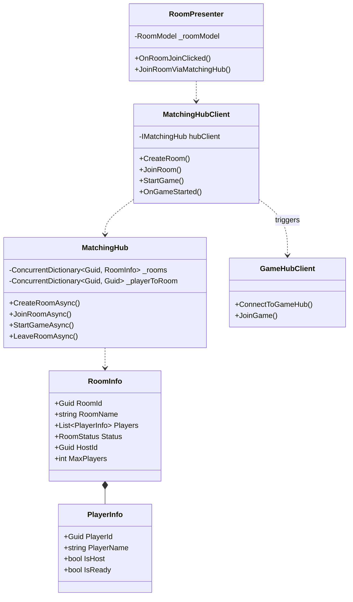
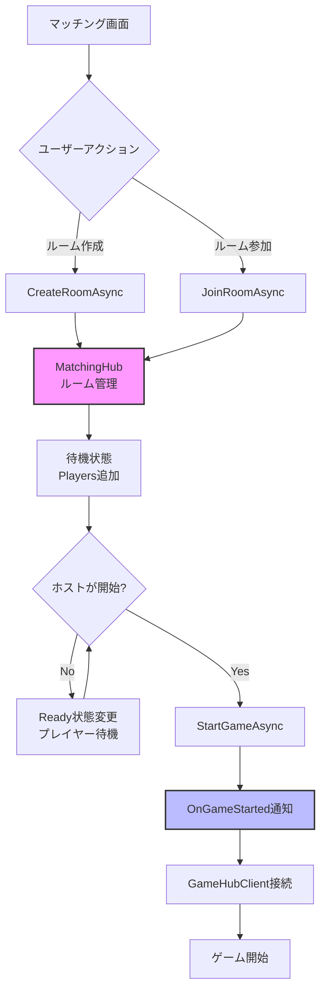
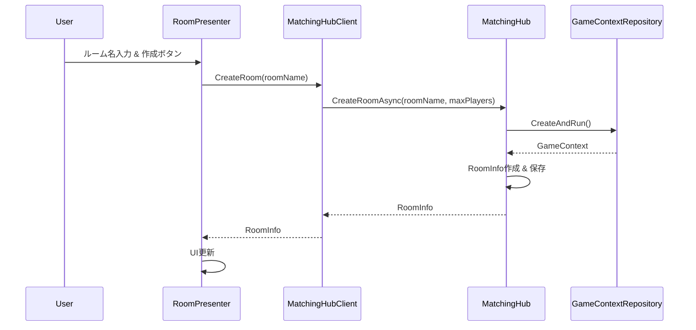
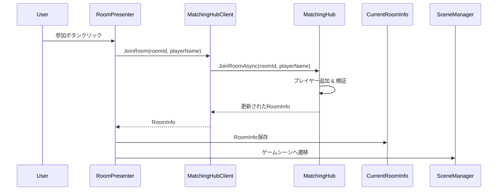
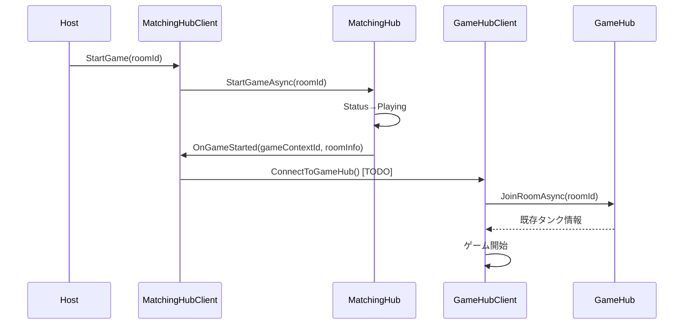

# MatchingSystem実装状況ドキュメント

## 概要

MatchingHub中心の待機室システムの実装状況と、現在のマッチング処理の流れを説明します。

## 実装済み変更点

### 1. Shared層の拡張

#### PlayerInfo クラス
```csharp
[MessagePackObject]
public class PlayerInfo
{
    [Key(0)] public Guid PlayerId { get; set; }
    [Key(1)] public string PlayerName { get; set; } = string.Empty;
    [Key(2)] public bool IsHost { get; set; }
    [Key(3)] public bool IsReady { get; set; }
}
```

#### RoomStatus 列挙型
```csharp
public enum RoomStatus
{
    Waiting = 0,    // プレイヤー募集中
    Playing = 1,    // ゲーム進行中
    Finished = 2    // ゲーム終了
}
```

#### RoomInfo クラス拡張
```csharp
[MessagePackObject]
public class RoomInfo
{
    [Key(0)] public Guid RoomId { get; set; }
    [Key(1)] public string RoomName { get; set; } = string.Empty;
    [Key(2)] public List<PlayerInfo> Players { get; set; } = new List<PlayerInfo>();
    [Key(3)] public RoomStatus Status { get; set; } = RoomStatus.Waiting;
    [Key(4)] public Guid HostId { get; set; }
    [Key(5)] public int MaxPlayers { get; set; } = 4;
}
```

### 2. IMatchingHub インターフェース拡張

```csharp
public interface IMatchingHub : IStreamingHub<IMatchingHub, IMatchingHubReceiver>
{
    ValueTask<RoomInfo> CreateRoomAsync(string roomName, int maxPlayers = 4);
    ValueTask<RoomInfo[]> GetRoomListAsync();
    ValueTask<RoomInfo> JoinRoomAsync(Guid roomId, string playerName);
    ValueTask LeaveRoomAsync(Guid roomId);
    ValueTask<RoomInfo> StartGameAsync(Guid roomId);
    ValueTask<RoomInfo> GetRoomStatusAsync(Guid roomId);
    ValueTask SetReadyStatusAsync(Guid roomId, bool isReady);
}
```

### 3. IMatchingHubReceiver インターフェース拡張

```csharp
public interface IMatchingHubReceiver
{
    void OnRoomCreated(RoomInfo roomInfo);
    void OnRoomUpdated(RoomInfo roomInfo);
    void OnRoomDeleted(Guid roomId);
    void OnPlayerJoinedRoom(PlayerInfo playerInfo, RoomInfo roomInfo);
    void OnPlayerLeftRoom(Guid playerId, RoomInfo roomInfo);
    void OnPlayerReadyChanged(Guid playerId, bool isReady);
    void OnGameStarted(Guid gameContextId, RoomInfo roomInfo);
    void OnGameEnded(Guid roomId);
}
```

## システムアーキテクチャ

### クラス関係図



### データフロー図



## 処理の流れ

### 1. ルーム作成フロー



### 2. ルーム参加フロー



### 3. ゲーム開始フロー



## 主要コンポーネントの役割

### MatchingHub (Server)
- **責任**: ルーム管理、プレイヤー管理、ゲーム開始制御
- **機能**:
  - ルーム作成・削除
  - プレイヤー参加・離脱管理
  - ホスト権限管理
  - ゲーム開始タイミング制御
- **状態管理**: 
  - `_rooms`: 全ルーム情報
  - `_playerToRoom`: プレイヤー→ルームマッピング

### MatchingHubClient (Unity)
- **責任**: MatchingHubとの通信、イベントハンドリング
- **機能**:
  - サーバーAPI呼び出し
  - サーバーイベント受信
  - GameHubClientとの連携（TODO）
- **重要メソッド**:
  - `OnGameStarted()`: ゲーム開始トリガー

### RoomPresenter (Unity)
- **責任**: UI制御、ユーザーアクション処理
- **機能**:
  - ルーム一覧表示
  - ルーム作成UI
  - ルーム参加処理
- **変更点**: `JoinRoomViaMatchingHub()`メソッド追加

### GameHubClient (Unity)
- **現在の状態**: 自動接続モード
- **TODO**: 手動接続モードに変更
  - `Start()`での自動接続を無効化
  - `ConnectToGameHub()`メソッド追加
  - `OnGameStarted`イベントからの呼び出し

## 現在の制限事項

### 1. ブロードキャスト通知
- サーバー側のブロードキャスト機能は一時的にコメントアウト
- ルーム更新通知が動作しない状態
- **修正必要**: MagicOnionのGroup機能を正しく実装

### 2. GameHubClient統合
- 自動接続モードのまま
- MatchingHubからの制御が未実装
- **修正必要**: 手動接続メソッドの実装

### 3. UI統合
- 待機室専用UIが未実装
- プレイヤー名入力が仮実装
- **修正必要**: 待機室シーン・UI作成

## 次のステップ

### 優先度: 高
1. **ブロードキャスト機能修正**
   - MagicOnionのGroup機能を正しく実装
   - リアルタイム通知の復活

2. **GameHubClient統合**
   - 手動接続モード実装
   - MatchingHubからの制御

### 優先度: 中
3. **待機室UI実装**
   - 専用シーン作成
   - プレイヤーリスト表示
   - Ready/Start機能

4. **エラーハンドリング強化**
   - 接続エラー処理
   - タイムアウト処理
   - 再接続機能

## 技術的詳細

### データ永続化
- **サーバー**: インメモリ（ConcurrentDictionary）
- **クライアント**: CurrentRoomInfoシングルトン
- **制限**: サーバー再起動で全データ消失

### ネットワーク通信
- **プロトコル**: MagicOnion (gRPC)
- **シリアライゼーション**: MessagePack
- **接続**: WebSocket over HTTP/2

### 同期モデル
- **ルーム状態**: サーバーが真の状態を保持
- **プレイヤー状態**: サーバー側で管理
- **UI更新**: Reactive Extensions (UniRx)

---

このドキュメントは実装の進行に応じて更新されます。