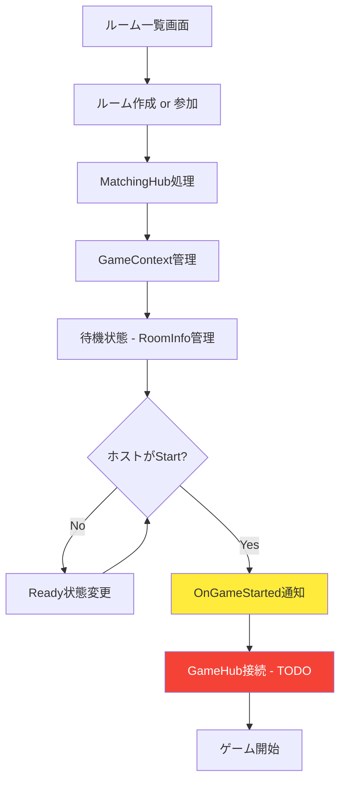

# 次の実装ステップ - MatchingHub待機室システム

## 📊 現在の実装状況

### ✅ 完了した実装

#### 1. **Shared層の拡張**
- `PlayerInfo`クラス: プレイヤー情報（ID、名前、ホスト権限、Ready状態）
- `RoomStatus`列挙型: Waiting/Playing/Finished
- `RoomInfo`クラス拡張: プレイヤーリスト、ステータス、ホスト管理
- インターフェース拡張: 参加/離脱/開始/Ready設定機能

#### 2. **Server側実装**
- **GameContext統合**: RoomInfo管理機能をGameContextに統合
- **コンストラクタ改良**: ルーム作成時に必ずRoomInfoも作成される設計
- **MatchingHub簡素化**: GameContext経由でのアクセスに変更
- **途中参加対応**: プレイ中のルームにも参加可能

#### 3. **Client側実装**
- **MatchingHubClient拡張**: 新しいAPI対応
- **RoomPresenter改良**: MatchingHub経由での参加機能

### 🎯 現在の動作フロー



### 🔧 実装済み機能

**ルーム管理:**
- ルーム作成（GameContext+RoomInfo同時作成）
- ルーム一覧取得（待機中+プレイ中）
- 途中参加対応

**プレイヤー管理:**
- 参加/離脱処理
- ホスト権限管理（自動移譲）
- Ready状態管理

**状態管理:**
- Waiting → Playing → Finished
- 一貫性保証（GameContext統合）

## 🎯 次にするべきこと

### 最優先（システム動作に必須）

#### 1. **GameHubClient統合** ⚡ **最重要**
現在、MatchingHubでゲーム開始しても、GameHubClientが自動接続してしまう問題があります。

**現在の問題:**
```csharp
// GameHubClient.cs - 現在の自動接続
async UniTaskVoid Start()
{
    channel = GrpcChannelx.ForAddress("http://localhost:5127");
    hubClient = await StreamingHubClient.ConnectAsync<IGameHub, IGameHubReceiver>(
        channel, this);
    // 即座にゲーム参加 - これが問題
    JoinGame(currentRoom.RoomId, spawnPosition, isSpectating);
}
```

**必要な変更:**
- [ ] `GameHubClient.Start()`の自動接続を無効化
- [ ] `ConnectToGameHub()`メソッド追加
- [ ] `MatchingHubClient.OnGameStarted()`からGameHub接続を呼び出し

**期待される動作:**
```csharp
// 修正後の動作
async UniTaskVoid Start()
{
    // 待機状態 - 接続しない
}

public async UniTask ConnectToGameHub()
{
    channel = GrpcChannelx.ForAddress("http://localhost:5127");
    hubClient = await StreamingHubClient.ConnectAsync<IGameHub, IGameHubReceiver>(
        channel, this);
    JoinGame(currentRoom.RoomId, spawnPosition, isSpectating);
}

// MatchingHubClient.OnGameStarted()から呼び出し
public void OnGameStarted(Guid gameContextId, RoomInfo roomInfo)
{
    GameHubClient.Instance?.ConnectToGameHub();
}
```

**影響:** これがないと待機室システムが機能しません

#### 2. **ブロードキャスト機能修正** 🔄
現在コメントアウトされているリアルタイム通知機能の実装。

**現在の状況:**
```csharp
// MatchingHub.cs - 現在コメントアウト中
// Group.GetOrAddGroup("MatchingLobby").All.OnRoomUpdated(roomInfo);
```

**必要な変更:**
- [ ] MagicOnionのGroup機能を正しく実装
- [ ] `OnRoomUpdated`, `OnPlayerJoinedRoom`等の通知復活
- [ ] クライアント側でのリアルタイム更新処理

**影響:** ルーム状態の同期ができません

### 中優先度（UX向上）

#### 3. **待機室UI実装** 🎨
専用の待機室画面とプレイヤーリスト表示。

**必要な要素:**
- [ ] 待機室専用シーン作成
- [ ] プレイヤーリスト表示UI
- [ ] Ready/Startボタン
- [ ] ルーム情報表示
- [ ] 離脱ボタン

#### 4. **エラーハンドリング強化** 🛡️
接続エラー、タイムアウト、再接続処理。

**必要な機能:**
- [ ] 接続失敗時の処理
- [ ] タイムアウト処理
- [ ] 再接続機能
- [ ] ユーザーフレンドリーなエラーメッセージ

## 🚀 推奨する実装順序

### Phase 1: コア機能完成 🔥
```
1. GameHubClient統合 
   ↓
2. ブロードキャスト修正 
   ↓  
3. 動作テスト
```

**優先理由:** システムの基本動作に必須

### Phase 2: UI/UX改善 ✨
```
4. 待機室UI 
   ↓
5. エラーハンドリング 
   ↓
6. 最終テスト
```

**優先理由:** ユーザー体験の向上

## 🔧 最初に取り組むべき具体的タスク

### GameHubClient統合（推奨開始点）

#### Step 1: 自動接続の無効化
```csharp
// GameHubClient.cs
async UniTaskVoid Start()
{
    // 自動接続処理をコメントアウトまたは削除
    // 待機状態にする
}
```

#### Step 2: 手動接続メソッド追加
```csharp
public async UniTask ConnectToGameHub()
{
    // 元のStart()の接続処理を移動
}
```

#### Step 3: MatchingHubからの呼び出し
```csharp
// MatchingHubClient.cs
public void OnGameStarted(Guid gameContextId, RoomInfo roomInfo)
{
    // GameHubClientの接続を開始
    GameHubClient.Instance?.ConnectToGameHub();
}
```

## 📈 実装の成果と期待効果

### 完了後の動作
1. **ルーム作成** → MatchingHubで管理
2. **プレイヤー参加** → 待機状態で管理
3. **ホストがStart** → 全員にOnGameStarted通知
4. **一斉GameHub接続** → ゲーム開始

### 技術的メリット
- **制御されたゲーム開始**: ホストの意思でゲーム開始
- **状態の一貫性**: MatchingHub → GameHubの明確な遷移
- **途中参加対応**: プレイ中でも参加可能
- **拡張性**: 将来的なルーム機能追加が容易

---

**次のステップ:** GameHubClient統合から開始することを強く推奨します。これにより完全な待機室→ゲーム開始フローが実現できます。